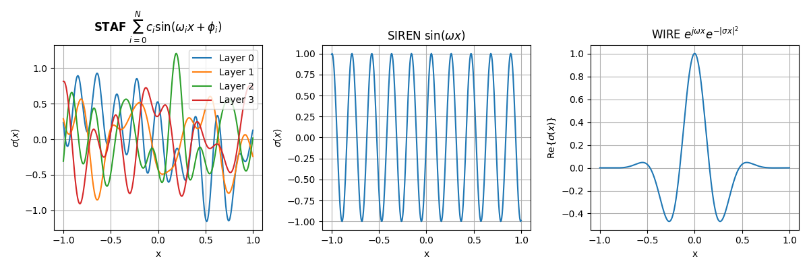

# STAF: Sinusoidal Trainable Activation Functions for Implicit Neural Representation *(Accepted in TMLR, June 2026)*

**Website:** [https://alirezamorsali.github.io/staf/](https://alirezamorsali.github.io/staf/)  
**Paper:** [https://openreview.net/pdf?id=ZDmBPYptbL](https://openreview.net/pdf?id=ZDmBPYptbL)

---

**STAF** is a novel approach that enhances Implicit Neural Representations (INRs) by introducing trainable sinusoidal activation functions. Specifically, STAF dynamically modulates its frequency components, enabling networks to adaptively learn and represent complex signals with higher precision and efficiency. It excels in signal representation, handling various tasks such as image, shape, and audio reconstructions, and tackles complex challenges like spectral bias and inverse problems, outperforming state-of-the-art methods in accuracy and reconstruction fidelity.


<br>

<p align="center">
  
</p>


## Get started

### Data
You can download the data utilized in the paper from this  [link](https://drive.google.com/file/d/1AXr64xXE_oQMIWBpgzZuh4ZtWEVyupLM/view?usp=drive_link).
Unzip the dataset, then copy it in the `data` directory in the code main directory.

### Requirements
Install the requirements with:
```bash
pip install -r requirements.txt
```


### Image Representation
The image experiment can be reproduced by running the `train_image.ipynb` notebook.

### Audio Representation
The audio experiment can be reproduced by running the `train_audio.ipynb` notebook.

### Shape Representation
The shape experiment can be reproduced by running the `train_sdf.ipynb` notebook. For your convenience, we have included the occupancy volume of Lucy, Thai, Armadillo and Dragon in the data file. 

> <picture>
>   <source media="(prefers-color-scheme: light)" srcset="https://raw.githubusercontent.com/Mqxx/GitHub-Markdown/main/blockquotes/badge/light-theme/note.svg">
>   
> </picture>
> <br>
>  The output is a <code>.dae</code> file that can be visualized using software such as Meshlab (a cross-platform visualizer and editor for 3D models).

### Image Denoising
The denoising experiment can be reproduced by running the `train_denoising.ipynb` notebook.

### Image Super-resolution
The super-resolution experiment can be reproduced by running the `train_sr.ipynb` notebook.

### NTK 
The NTK eigenfunctions and eigenvalues can be reproduced by running the `figure_5.py` of `inr_dictionaries`.

